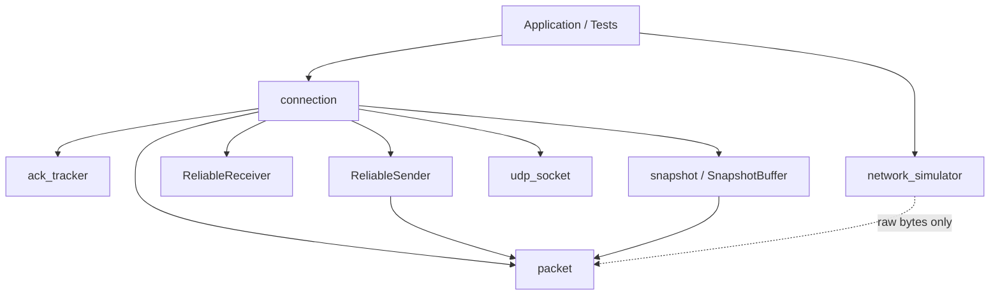
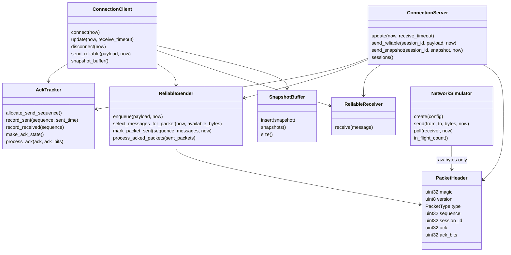
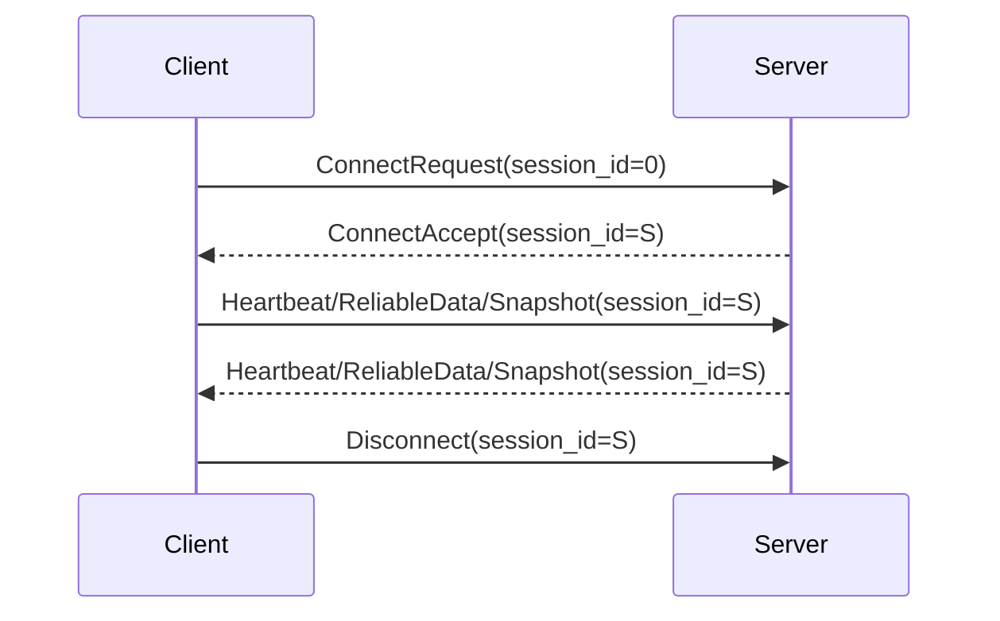
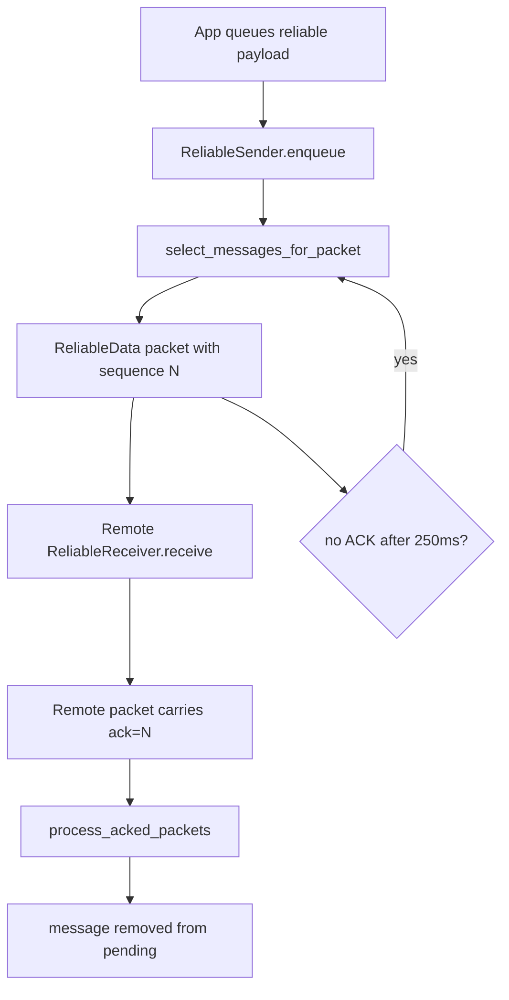
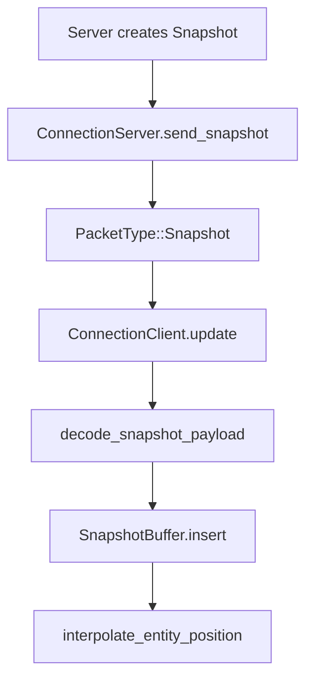
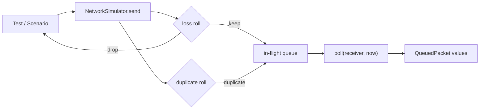

# MiniNet Architecture

本文档说明 MiniNet 当前核心模块的职责边界和数据流。它用于帮助理解代码结构，不提出新的协议行为。

## Module Overview

`UdpSocket` 和 `NetworkSimulator` 都处理 bytes，但位置不同：

- `UdpSocket` 是真实 OS UDP socket 封装。
- `NetworkSimulator` 是测试用 in-memory packet queue。
- 当前 `ConnectionClient` / `ConnectionServer` 仍直接使用 `UdpSocket`，没有被改造成 simulator transport。

## Core Modules

### `packet`

负责：

- `PacketHeader`
- `PacketType`
- `ByteView`
- header encode/decode
- packet type validation
- magic/version/type/session 基础校验

不负责：

- socket IO
- connection 状态
- reliable message payload 解析
- snapshot payload 解析
- ACK 状态维护

### `ack_tracker`

负责：

- 分配本端出站 `sequence`
- 记录收到的对端 sequence
- 生成 `ack / ack_bits`
- 记录本端已发送 packet
- 根据对端发来的 `ack / ack_bits` 标记 sent packet 为 acked

不负责：

- 可靠消息的 pending queue
- message-level delivery
- snapshot buffer
- 真实网络发送

### `connection`

负责：

- UDP 之上的 virtual connection 状态
- `Disconnected / Connecting / Connected / TimedOut`
- `ConnectRequest / ConnectAccept`
- `Heartbeat`
- `Disconnect`
- session id 分配和匹配
- timeout 判断
- 调用 `AckTracker` 处理连接内 packet ACK
- 接入 reliable message 和 snapshot 的发送/接收路径

不负责：

- packet header 字节格式细节
- reliable payload 编解码细节
- snapshot payload 编解码细节
- 网络模拟器
- ordered delivery

### `reliable_message`

负责：

- reliable unordered message 数据结构
- `ReliableData` payload encode/decode
- pending reliable queue
- 选择需要发送或重发的消息
- 记录 `packet sequence -> message_id list`
- packet ACK 后清理 delivered message
- 接收端按 `message_id` 去重

不负责：

- ordered delivery
- fragmentation
- congestion control
- RTT-based resend timeout
- 真实 socket IO

### `snapshot`

负责：

- `Snapshot` / `EntityState` / `Vec2f`
- Snapshot payload encode/decode
- `SnapshotBuffer`
- 乱序插入
- 重复/过旧 snapshot 丢弃
- buffer 容量淘汰
- 两个 snapshot 间同一 entity 的 position interpolation
- 60Hz update / 20Hz send interval helper

不负责：

- reliable resend
- snapshot-level ACK
- extrapolation
- client prediction
- rollback
- delta compression

### `network_simulator`

负责：

- raw bytes 层面的 loss
- latency / jitter
- duplicate packet
- reordering
- deterministic seed
- `poll(receiver, now)` 投递到期 packet

不负责：

- 真实 socket
- `PacketHeader` 解析
- reliable payload 解析
- snapshot payload 解析
- 改造 `ConnectionClient` / `ConnectionServer`
- 拥塞控制或带宽限制

### `udp_socket`

负责：

- OS UDP socket 创建、绑定、关闭
- `send_to`
- `receive_from`
- Windows / POSIX socket 差异封装

不负责：

- MiniNet packet 语义
- connection 状态
- ACK
- reliable message
- snapshot

## Class Diagram

## Connection Data Flow

Important boundaries:

- `ConnectRequest` is not part of connected packet ACK tracking.
- Connected packets use per-endpoint/per-session `AckTracker`.
- Service packets can carry `ack / ack_bits` even when their payload is empty.

## Reliable Message Data Flow

Reliable delivery is derived from packet ACK:

- Message delivery is not confirmed by a dedicated message ACK.
- A message is delivered when any packet carrying it is ACKed.
- Receiver dedup ensures repeated delivery attempts do not execute application logic twice.

## Snapshot Data Flow

Snapshot is intentionally unreliable:

- It is sent once.
- It is not queued in `ReliableSender`.
- It is not retransmitted.
- Newer snapshots can make older lost snapshots irrelevant.

## Network Simulator Data Flow

The simulator is protocol independent:

- It can carry invalid MiniNet bytes.
- It can carry valid packet bytes.
- It does not inspect the difference.

## Packet Paths

### Header-only control packet

1. Connection builds `PacketHeader`.
2. `packet` encodes the header.
3. `udp_socket` sends bytes.
4. Receiver decodes and validates header.
5. Connection state machine handles type/session/timeout.

### Reliable message packet

1. Application queues payload.
2. `ReliableSender` assigns `message_id`.
3. Connection allocates packet `sequence`.
4. `reliable_message` encodes payload.
5. Receiver decodes and deduplicates by `message_id`.
6. Later packet ACK confirms `sequence`.
7. Sender maps `sequence` back to `message_id` and clears pending message.

### Snapshot packet

1. Server creates `Snapshot`.
2. Connection allocates packet `sequence`.
3. `snapshot` encodes payload.
4. Client receives and decodes payload.
5. Client inserts into `SnapshotBuffer`.
6. Upper layer may interpolate between buffered snapshots.

## Design Principles

- Keep packet encoding separate from socket IO.
- Keep connection state separate from payload-specific logic.
- Treat ACK as packet-level transport information.
- Implement reliable and unreliable data paths separately.
- Prefer deterministic tests over relying on localhost behavior.
- Keep learning implementation explicit before adding abstractions.
