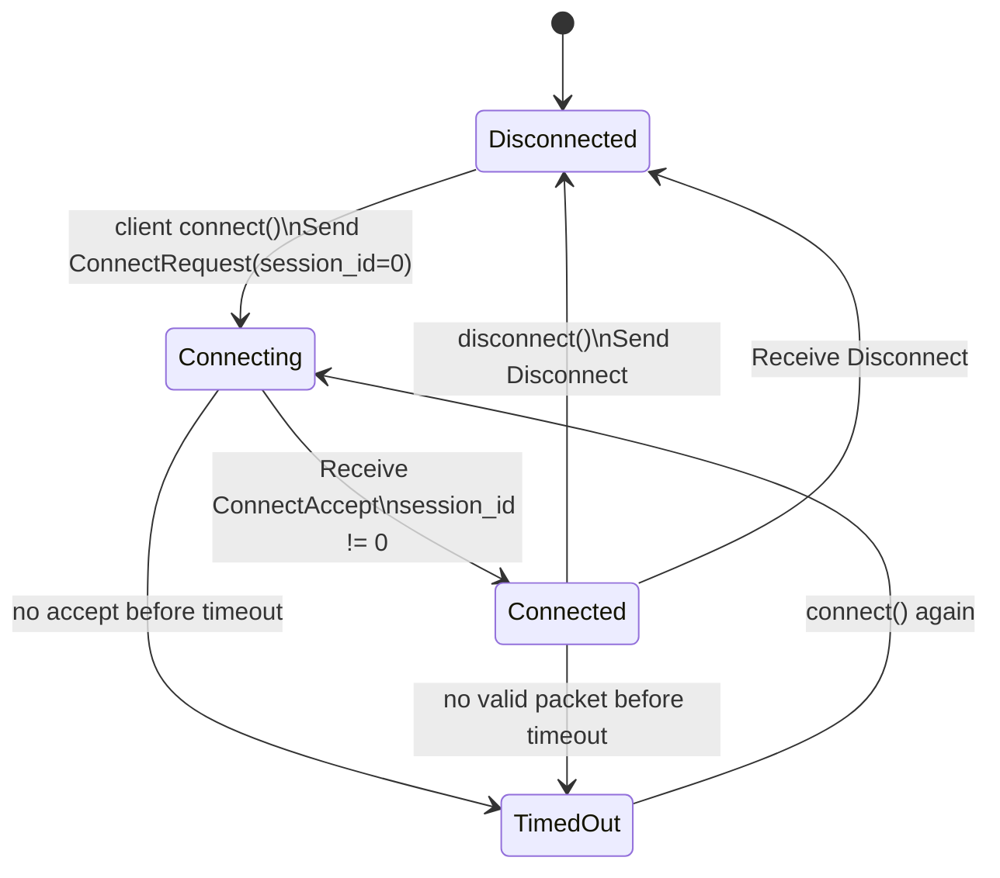
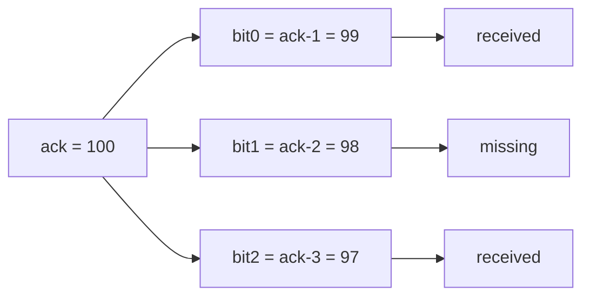
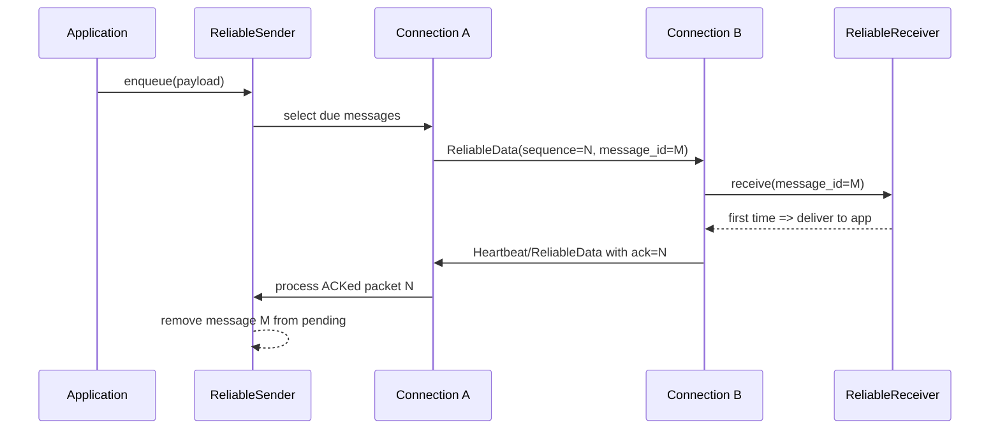
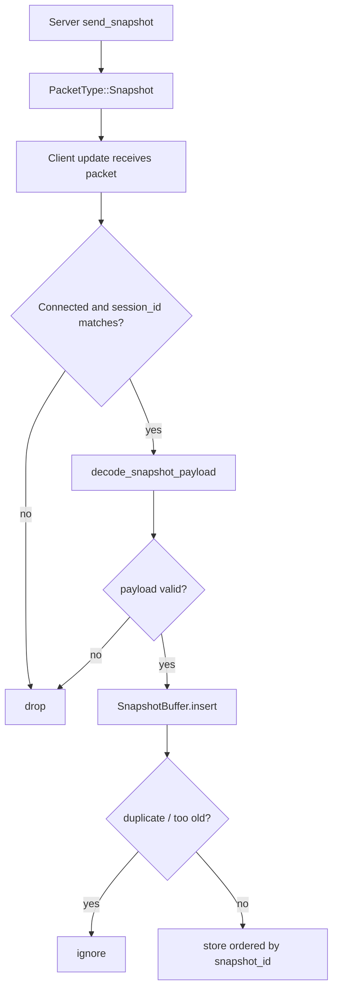
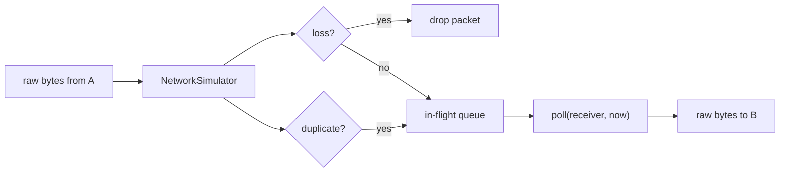

# MiniNet Protocol

本文档描述 MiniNet 当前已经实现的 UDP 协议格式和传输语义。它只记录现有实现，不描述尚未实现的 reliable ordered delivery、fragmentation、congestion control 等能力。

## Packet Header

所有 MiniNet packet 都以固定 22 字节 `PacketHeader` 开头。这个 header 会被显式编码成网络字节序，不能直接发送 C++ struct 内存。

| Offset | Size | Field | Meaning |
| --- | ---: | --- | --- |
| 0 | 4 | `magic` | 固定为 `0x4D4E4554`，ASCII 为 `MNET`。 |
| 4 | 1 | `version` | 当前为 `1`。 |
| 5 | 1 | `type` | `PacketType` 的 `uint8_t` 值。 |
| 6 | 4 | `sequence` | 当前发送方分配的 packet sequence。 |
| 10 | 4 | `session_id` | UDP virtual connection 的 session id。 |
| 14 | 4 | `ack` | 当前发送方最近收到的对方 packet sequence。 |
| 18 | 4 | `ack_bits` | `ack` 之前 32 个 sequence 的接收位图。 |

`ConnectRequest` 的 `session_id` 必须为 `0`。`ConnectAccept` 和连接建立后的 packet 使用服务端分配的非 0 `session_id`。

## Packet Types

| Value | Name | Payload | Purpose |
| ---: | --- | --- | --- |
| 1 | `Ping` | none | 最小 UDP ping 测试。 |
| 2 | `Pong` | none | 对 `Ping` 的响应。 |
| 3 | `ConnectRequest` | none | 客户端请求建立 virtual connection。 |
| 4 | `ConnectAccept` | none | 服务端接受连接并返回 `session_id`。 |
| 5 | `Disconnect` | none | 显式断开连接。 |
| 6 | `Heartbeat` | none | 保持连接活跃，并携带 packet ACK 状态。 |
| 7 | `ReliableData` | ReliableData payload | 发送可靠无序消息。 |
| 8 | `Snapshot` | Snapshot payload | 发送不可靠状态快照。 |

## Connection Flow

服务端按客户端 `UdpEndpoint` 去重重复的 `ConnectRequest`。如果同一个 endpoint 再次发送握手请求，服务端复用已有 `session_id` 回 `ConnectAccept`。

## ACK And ACK Bits

MiniNet 的 ACK 是 packet-level ACK，而不是业务层 message ACK。

- `sequence`：当前发送方发出的 packet 编号。
- `ack`：当前发送方最近收到的对方 packet sequence。
- `ack_bits`：`ack` 之前 32 个 sequence 的接收状态。
- `ack_bits` 的 bit 0 表示 `ack - 1`。
- `ack_bits` 的 bit 31 表示 `ack - 32`。
- Client 和 Server 各自独立维护自己的 sequence。

示例：如果一端已经收到对方的 packet `100`、`99`、`97`，那么：

| Field | Value |
| --- | --- |
| `ack` | `100` |
| `ack_bits` bit 0 | `1`，表示收到 `99` |
| `ack_bits` bit 1 | `0`，表示未收到 `98` |
| `ack_bits` bit 2 | `1`，表示收到 `97` |

ACK 系统确认的是 packet 是否到达。`ReliableSender` 会把 packet ACK 映射回 message delivery，但 ACK 本身不直接等同于业务 message ACK。

## ReliableData Payload

`ReliableData` 只在 virtual connection 建立后使用。它使用普通 `PacketHeader`，因此仍携带 `sequence / ack / ack_bits`。

当前 payload 格式如下：

| Field | Size | Meaning |
| --- | ---: | --- |
| `message_count` | 1 | 当前 packet 中携带的 reliable message 数量。 |
| `message_id` | 4 | 发送端分配的 reliable message id。 |
| `payload_size` | 2 | 该 message 的 payload 字节数。 |
| `payload bytes` | variable | 上层应用 payload。 |

`message_id + payload_size + payload bytes` 会重复 `message_count` 次。当前实现没有 `message_type` 字段。

可靠无序消息的语义：

- `ReliableSender` 为每条消息分配递增 `message_id`。
- 未 delivery 的消息保存在 pending queue。
- 一个 `ReliableData` packet 发送后，发送端记录 `packet sequence -> message_id list`。
- 当任意携带某 message 的 packet 被 ACK，该 message 视为 delivered，并从 pending queue 清理。
- 如果消息未被 ACK，超过 `250ms` 后可以被重新放入新的 packet sequence 中。
- `ReliableReceiver` 按 `message_id` 去重，重复消息不会再次交给上层处理。
- 当前只保证 unordered reliable，不保证 ordered delivery。

## Snapshot Payload

`Snapshot` 是不可靠状态同步 packet。它适合高频实体状态，例如位置和速度。

Snapshot 不进入 `ReliableSender`，不重传，不产生 snapshot-level ACK。它仍使用 packet header 的 `sequence / ack / ack_bits`，但这些 ACK 只属于 packet-level tracking。

Snapshot payload 格式：

| Field | Size | Meaning |
| --- | ---: | --- |
| `snapshot_id` | 4 | 服务端递增的 snapshot id。当前不处理 uint32 回绕。 |
| `server_tick` | 4 | 服务端逻辑 tick。 |
| `server_time_ms` | 8 | 服务端时间戳，单位毫秒。 |
| `entity_count` | 4 | 当前 snapshot 中的 entity 数量，最大为 32。 |
| `entity_id` | 4 | 实体 id。 |
| `position.x` | 4 | IEEE 754 binary32 float。 |
| `position.y` | 4 | IEEE 754 binary32 float。 |
| `velocity.x` | 4 | IEEE 754 binary32 float。 |
| `velocity.y` | 4 | IEEE 754 binary32 float。 |

`EntityState` 字段会重复 `entity_count` 次。

客户端收到合法 Snapshot 后：

- 按 `snapshot_id` 插入 `SnapshotBuffer`。
- 重复 `snapshot_id` 不插入。
- 非空 buffer 中 `snapshot_id <= oldest snapshot_id` 视为过旧。
- 超过 `kSnapshotBufferCapacity = 32` 后移除最旧 snapshot。
- 当前插值 helper 只做两个 snapshot 之间同一 entity 的 position lerp。

## Heartbeat, Timeout, Disconnect

`Heartbeat` 是 header-only packet，用于：

- 连接空闲时保持双方有 packet 往来。
- 携带最新 `ack / ack_bits`。
- 让对端刷新 `last_recv_time`，避免误判 timeout。

默认配置：

- Heartbeat interval: `1000ms`
- Timeout: `5000ms`

`Disconnect` 是显式礼貌断开。如果 `Disconnect` 丢包，另一端仍可依靠 timeout 清理状态。

## Network Simulator

`NetworkSimulator` 是测试工具，不是协议的一部分。它只处理 raw bytes 和 `UdpEndpoint`：

- `loss_rate` 模拟丢包。
- `duplicate_rate` 模拟重复包。
- `min_latency / max_latency` 模拟固定延迟或 jitter。
- 不解析 `PacketHeader`。
- 不理解 ReliableData。
- 不理解 Snapshot。
- 不修改 connection、ACK、reliable、snapshot 语义。

## Current Non-Goals

MiniNet 当前不支持：

- Reliable ordered delivery
- Fragmentation / large packet transfer
- Congestion control
- Flow control
- Encryption
- Authentication
- NAT traversal
- Client prediction
- Rollback
- Server reconciliation
- Delta compression
- Interest management
- Entity priority
- Bandwidth budget
- Production-grade security validation
